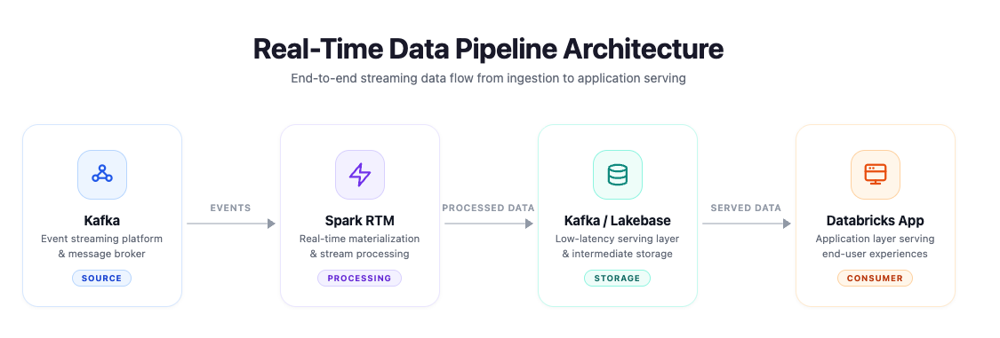

# Databricks Real-Time Mode Solution Accelerator: Fraud Detection

[](https://databricks.com)
[](https://docs.databricks.com/en/data-governance/unity-catalog/index.html)
[](https://docs.databricks.com/aws/en/structured-streaming/real-time.html)

---

## Overview

This repository contains an end-to-end implementation of **real-time fraud detection** using Databricks **Real-Time Mode** in Apache Spark Structured Streaming. It demonstrates how to detect and block fraudulent transactions in **sub-300ms** — directly on the Databricks Data Intelligence Platform, with no separate streaming engine required.

Fraud detection demands sub-second latency — a fraudulent transaction must be blocked *before* it settles. Historically this has meant licensing separate specialized streaming engines outside the data platform, adding cost, operational complexity, and yet another tool to integrate and maintain. Traditional micro-batch processing simply can't meet the latency these workloads require, forcing teams to operate two parallel stacks.

With [**Real-Time Mode**](https://www.databricks.com/blog/introducing-real-time-mode-apache-sparktm-structured-streaming) (GA March 2026), Databricks brings **sub-300ms end-to-end latency** directly into Spark Structured Streaming — same APIs, same platform, no separate engine needed.

### What this solution does

- **Detect fraud in sub-300ms** using Real-Time Mode's `trigger(realTime=...)` for continuous processing
- **Track per-card velocity** with `transformWithState` (stateful processing with TTL-based expiration)
- **Enrich transactions** using dictionary-based merchant and card profile lookups (no `BroadcastExchange` overhead)
- **Score transactions with ML** using a RandomForest model trained with MLflow, served as a Spark UDF
- **Stream features to Lakebase** (managed PostgreSQL) as an online feature store for sub-millisecond reads
- **Monitor fraud in real time** with a Streamlit-based Databricks App dashboard

While this example focuses on financial fraud, the same architecture applies to any low-latency streaming use case — real-time bidding, IoT anomaly detection, network intrusion detection, e-commerce session scoring, supply-chain event processing, and so on.


## Architecture



Events flow from Kafka through Spark Real-Time Mode (parse → velocity tracking → enrichment → scoring → routing), with Lakebase serving as the online feature store and the Databricks App providing live monitoring on top.

The technologies used:

1. **Real-Time Mode** — sub-300ms streaming with `trigger(realTime=...)` for continuous processing
2. **transformWithState** — per-key stateful processing with TTL for velocity tracking
3. **Lakebase** — managed PostgreSQL as an online feature store, written via the public `foreach` sink
4. **MLflow** — model training, versioning, and serving as a Spark UDF
5. **Databricks Apps** — Streamlit-based live fraud monitoring dashboard
6. **Delta Lake & Unity Catalog** — unified data storage and governance

---

## Recommended path: manual cluster + run the notebooks step-by-step

> **For your first run, we recommend the manual path.** Real-Time Mode has specific cluster requirements that are easy to misconfigure, and running the streaming notebooks one at a time gives you a chance to inspect each stage's metrics, latency, and Lakebase state. Once you understand the flow, you can fall back to the [Asset Bundle path](#advanced-asset-bundle-deployment) for repeatable deployments.

### Prerequisites

- A Databricks workspace with Unity Catalog enabled
- Databricks CLI installed and authenticated ([installation guide](https://docs.databricks.com/en/dev-tools/cli/install))
- Permissions to create clusters and Lakebase instances
- (For Steps 2 & 3) A Kafka cluster, AWS MSK or Confluent Cloud 

### Step 1: Create a Real-Time Mode cluster

Real-Time Mode is picky about cluster configuration. 

| Setting | Required value |
|---|---|
| Databricks Runtime | **`18.0 LTS`** (Spark 4.x, Scala 2.13). Newer runtimes may have RTM regressions; pin to this LTS version for now. |
| Access mode | **Dedicated** (Single User) |
| Photon acceleration | **Disabled** (runtime engine: STANDARD) |
| Autoscaling | **Disabled** — use a fixed worker count |
| Workers | 6 × `i3.xlarge` (or equivalent on Azure / GCP). Driver same. |
| Spark config | `spark.databricks.streaming.realTimeMode.enabled true`<br>`spark.sql.shuffle.partitions 4` |


### Step 2: (For RTM_01 and RTM_02 only) Set up the Kafka secret scope

The Quick Start notebook (`RTM_00`) does **not** require Kafka. You only need this for the full pipeline notebooks.

```bash
# 1. Create a secret scope
databricks secrets create-scope my-kafka-scope

# 2. Store your Kafka TLS bootstrap servers (port 9094)
databricks secrets put-secret my-kafka-scope kafka-bootstrap-servers-tls \
  --string-value "b-1.your-cluster.kafka.region.amazonaws.com:9094,b-2.your-cluster.kafka.region.amazonaws.com:9094"

# 3. (Optional) Plaintext bootstrap servers (port 9092)
databricks secrets put-secret my-kafka-scope kafka-bootstrap-servers-plaintext \
  --string-value "b-1.your-cluster.kafka.region.amazonaws.com:9092"
```

Then, when you open `RTM_01` and `RTM_02` in your workspace, set the `secret_scope` widget at the top of each notebook to your scope name (e.g., `my-kafka-scope`).

### Step 3: Clone the repo into your workspace

From the Databricks UI: **Workspace** → click your home folder → **Create** → **Git folder** → paste `https://github.com/databricks-industry-solutions/rtm-fraud-detection.git`.

Or via the CLI:

```bash
databricks repos create \
  --url https://github.com/databricks-industry-solutions/rtm-fraud-detection.git \
  --provider gitHub \
  --path /Workspace/Users/your.name@your-company.com/rtm-fraud-detection
```

### Step 4: Run the notebooks

Open each notebook in your workspace, attach the `rtm-fraud-cluster` you just created, and run cells top-to-bottom. Run them **in order**, one at a time — don't kick them off as a job until you've validated the flow once.

#### `00_Introduction`
**Read this first.** Context-only notebook — the business problem, architecture, prerequisites. No code execution.

#### `RTM_00_Quick_Start`
Self-contained RTM demo with **zero external dependencies**. Uses the built-in `rate` source and `display()` for output. **Five minutes** to validate that Real-Time Mode works on your cluster. If this doesn't show sub-300ms latency, fix the cluster before moving on.

#### `RTM_01_Introduction_fraud_detection`
End-to-end Kafka pipeline with:
- Stateful velocity tracking via `transformWithState` (per-card transaction counting with TTL)
- Dictionary-based enrichment for merchant/card profile lookups
- Weighted multi-signal fraud scoring with explainable features
- Routing to approved / flagged / blocked output Kafka topics

*Requires: Kafka with TLS on port 9094, secret scope set up in Step 2.*

#### `RTM_02_Advanced_fraud_detection_ml`
Upgrades from rules to ML:
- **Streams features to Lakebase** (online feature store) using the public `foreach` sink and a custom `LakebaseFeatureWriter` (see `notebooks/resources/00_lakebase_writer`)
- **Trains a RandomForest model** tracked in MLflow
- **Scores transactions in real-time** with the model loaded as a Spark UDF

*Requires: Kafka + a Lakebase instance.*

### Step 5: Deploy the fraud monitoring dashboard

Once `RTM_02` has populated Lakebase with at least a few minutes of feature and score rows, deploy the Streamlit app in `apps/` as a Databricks App. The app reads directly from Lakebase via a resource binding (no manual connection strings) and renders total transactions, decision breakdown, recent fraud scores, and a fraud-probability distribution. The sidebar has an optional 10-second auto-refresh toggle.

**Prerequisites**

- `RTM_02` has been run and is populating the Lakebase tables `fraud_scores` and `card_features`.
- You know the Lakebase **instance name** you used in `RTM_02` (the value of the `lakebase_instance` widget).
- The same Lakebase database (default `databricks_postgres`).

#### Option A — Deploy via the Databricks UI

1. **Compute** → **Apps** → **Create App**
2. Name it (e.g., `rtm-fraud-dashboard`) and pick a workspace folder for the metadata
3. Under **Source code path**, point to the `apps/` folder of this repo in your workspace, e.g.
   `/Workspace/Users/<your-email>/rtm-fraud-detection/apps`
4. Under **Resources**, click **Add resource** → **Database**:
   - **Resource name**: `lakebase-db` (any name; the app reads `PG*` env vars regardless)
   - **Database instance**: pick your Lakebase instance — the same one used in `RTM_02`
   - **Database name**: `databricks_postgres` (or whatever you set `LAKEBASE_DATABASE` to)
   - **Permission**: `CAN_CONNECT_AND_CREATE`
5. Click **Create**, then **Deploy**

The app reads its config from the `PG*` environment variables that the Lakebase resource binding auto-injects (`PGHOST`, `PGUSER`, `PGDATABASE`, `PGPORT`, `PGSSLMODE`, `PGAPPNAME`). You do **not** need to configure connection strings manually.

When deployment finishes, the **App URL** is shown in the app's overview page — click it to open the live dashboard.

#### Option B — Deploy via the CLI

```bash
# 1. Sync the apps/ folder into your workspace (skip if already there via Git Folder)
databricks workspace import-dir apps/ \
  /Workspace/Users/<your-email>/rtm-fraud-detection/apps --overwrite

# 2. Create the app
databricks apps create rtm-fraud-dashboard \
  --description "Real-time fraud detection dashboard powered by Lakebase"

# 3. Deploy the source code with the Lakebase resource binding
databricks apps deploy rtm-fraud-dashboard \
  --source-code-path /Workspace/Users/<your-email>/rtm-fraud-detection/apps
```

After deploy, fetch the app URL:

```bash
databricks apps get rtm-fraud-dashboard --output json | jq -r .url
```

> **Note on the resource binding**: the CLI flow above creates the app but you'll still need to attach the Lakebase resource via the UI (Apps → your app → Resources → Add resource), or via `databricks apps update` with a `resources` block. The resource binding is what populates the `PG*` env vars the app expects.

#### What the app shows

- Total transactions scored, decision breakdown (APPROVED / FLAGGED / BLOCKED)
- Recent fraud scores with card-level detail
- Fraud probability distribution
- Sidebar toggle for **10-second auto-refresh** (default off so you can pin a moment in time when investigating)

#### Troubleshooting

- **App loads but shows "no data"** — `RTM_02` hasn't populated the tables yet. Confirm with `SELECT count(*) FROM fraud_scores;` against your Lakebase instance.
- **Connection errors / `PGHOST is None`** — the Lakebase resource binding isn't attached. Re-add it in **Apps → your app → Resources**, then redeploy.
- **OAuth `Unauthorized` after ~15 minutes** — the app refreshes the OAuth token every 15 min via `workspace_client.config.oauth_token()`; if you see auth errors persisting, check the app's logs (Apps → your app → Logs) for SDK or token errors.

### Supporting resources

The `notebooks/resources/` directory holds shared utilities loaded via `%run` from the main notebooks:

- **`00_config`** — cluster validation, Kafka credentials, per-user topic naming
- **`00_datagenerator`** — Kafka producer for synthetic transactions
- **`00_reference_data`** — merchant and card profile reference tables
- **`00_lakebase_writer`** — `LakebaseFeatureWriter` class used by `RTM_02` to upsert features into Lakebase via `foreach`

### Cleanup

When you're done, tear down everything:

```bash
bash scripts/cleanup.sh
```

This removes the Kafka topics, the Lakebase tables, MLflow experiments, and checkpoint directories. Delete the cluster from the Compute UI separately if you no longer need it.

---

## Advanced: Asset Bundle deployment

Once you've run the notebooks manually and understand the flow, the Databricks Asset Bundle in this repo provides a one-command deploy + run for repeatable demos and CI.

```bash
git clone https://github.com/databricks-industry-solutions/rtm-fraud-detection.git
cd rtm-fraud-detection
databricks bundle deploy
databricks bundle run rtm_fraud_detection_workflow
```

The bundle creates a job cluster matching the configuration above, runs `00_Introduction`, `RTM_00_Quick_Start`, `RTM_01_Introduction_fraud_detection`, and `RTM_02_Advanced_fraud_detection_ml` in sequence, and tears the cluster down when the run completes.

> **Caveat**: the bundle path runs all four notebooks back-to-back as a job. Streaming queries are continuous, so each task will run until you stop it (or the cluster auto-terminates). For *exploration*, the manual path is friendlier — you can leave each query running and inspect its progress before moving on. For *demos*, the bundle path is cleaner.

---

## Cost considerations

Cost depends on:
- Cluster compute (6 × `i3.xlarge` Dedicated, no autoscaling)
- Kafka cluster (AWS MSK or Confluent Cloud) — only for Steps 2 and 3
- Lakebase instance — only for Step 3 / the dashboard
- Databricks App serving hours — only if you deploy the dashboard

The Quick Start notebook (`RTM_00`) has no external dependencies and minimal cost — start there.

## References

- [Introducing Real-Time Mode for Apache Spark Structured Streaming](https://www.databricks.com/blog/introducing-real-time-mode-apache-sparktm-structured-streaming)
- [Real-Time Mode documentation](https://docs.databricks.com/aws/en/structured-streaming/real-time.html)
- [Real-Time Mode examples](https://docs.databricks.com/aws/en/structured-streaming/real-time-examples)
- [Stateful applications with `transformWithState`](https://docs.databricks.com/aws/en/stateful-applications/)
- [Lakebase documentation](https://docs.databricks.com/en/database/lakebase.html)
- [MLflow Model Registry](https://mlflow.org/docs/latest/model-registry.html)

## Authors

- **Sixuan He** ([sixuan.he@databricks.com](mailto:sixuan.he@databricks.com)) 
- **Navneeth Nair** ([navneeth.nair@databricks.com](mailto:navneeth.nair@databricks.com))

## Contributing

We welcome contributions. See [CONTRIBUTING.md](CONTRIBUTING.md) for guidelines.

## Security

Please review [SECURITY.md](SECURITY.md).

## License

&copy; 2026 Databricks, Inc. All rights reserved.

The source in this project is provided subject to the [Databricks License](https://databricks.com/db-license-source). Third-party libraries are subject to the licenses below.

| Package | License | Copyright |
|---------|---------|-----------|
| kafka-python | Apache 2.0 | Dana Powers, David Arthur, Thomas Siber |
| streamlit | Apache 2.0 | Snowflake Inc. |
| psycopg | LGPL 3.0 | Daniele Varrazzo |
| pandas | BSD 3-Clause | AQR Capital Management |
| databricks-sdk | Apache 2.0 | Databricks, Inc. |

## Support

1. Check the [Databricks documentation](https://docs.databricks.com)
2. Open an issue in this repository
3. Contact Databricks support if you're a customer

---

**Ready to detect fraud in real time?** Create the cluster from Step 1 above, attach `RTM_00_Quick_Start`, and run it — you'll see sub-300ms streaming in under 5 minutes.
